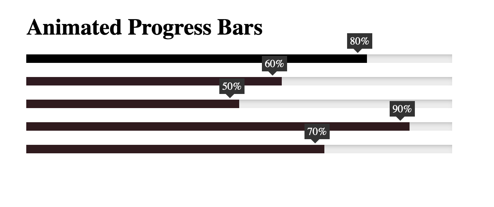

# Animated Progess Bar

## Description

This project is an animated progress bar created using jQuery. The progress bar is designed to provide visual feedback about the completion status of a process or task. It's highly customizable, allowing you to adjust its appearance and animation speed to fit your needs. The progress bar is also responsive, making it suitable for both desktop and mobile interfaces. It's a simple yet effective tool for enhancing user experience by clearly indicating the progress of operations.

## Image

